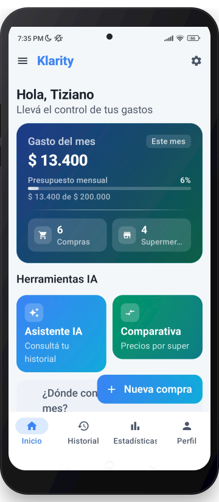

<div align="center">

# Klarity

### Registrá, analizá y ahorrá en tus compras de supermercado

Conocé a dónde va tu dinero — escaneá tickets con IA, compará precios entre supermercados y llevá el control de tu presupuesto, todo desde el celular.

[](https://kotlinlang.org)
[](https://developer.android.com/jetpack/compose)
[](https://developer.android.com)
[](https://nodejs.org)
[](https://www.postgresql.org)

<br/>



</div>

---

## ✨ Funcionalidades

- 🔐 **Cuenta y sesión** — registro, login y biometría (huella/PIN) con el token cifrado en Android Keystore, nunca en texto plano.
- 🧾 **Compras y productos** — alta, edición y borrado de compras con sus productos, foto del ticket adjunta desde cámara o galería.
- 🤖 **Escaneo de ticket con IA** — Gemini Vision lee el ticket y carga los productos automáticamente (nombre, precio, cantidad), con corrección manual para lo que no se lee bien.
- 💬 **Asistente de chat IA** — preguntás en lenguaje natural sobre tu historial de compras y consumos.
- 📊 **Comparativa de precios** — compara tu ticket contra precios de referencia (SEPA) y entre supermercados, mostrando dónde te convenía comprar.
- 📈 **Estadísticas** — gasto por mes, por supermercado, productos más comprados y evolución del presupuesto.
- 🔔 **Alertas de precio** — notificaciones periódicas (WorkManager) cuando un producto sube de precio.
- 🌓 **Tema e idioma** — modo oscuro y soporte español / inglés.

## 🏗️ Arquitectura

**MVVM** de punta a punta, con **Room como fuente de verdad** para todo lo que se puede cachear: el `Repository` consulta Room primero, refresca contra la API cuando corresponde, y la UI siempre observa el `Flow` de Room — nunca lee una respuesta de red directamente.

```
ViewModel → Repository → ① Room (caché, Flow que observa la UI)
                       → ② Retrofit (red, escribe el resultado en Room)
```

| Capa | Tecnología |
|------|-----------|
| UI | Jetpack Compose + Material 3 |
| Arquitectura | MVVM (`ViewModel` + `StateFlow`) |
| Inyección de dependencias | Hilt |
| Navegación | Navigation Compose |
| Persistencia de sesión/preferencias | Jetpack DataStore |
| Base de datos local | Room (compras, productos, supermercados, comparativa de precios) |
| Networking | Retrofit + OkHttp + Gson |
| Biometría | AndroidX Biometric + Android Keystore (AES-GCM) |
| Imágenes | Coil |
| Gráficos | Vico (Compose) |
| Background work | WorkManager + Hilt Work |

### Backend (`/backend`)

| Capa | Tecnología |
|------|-----------|
| Runtime | Node.js + TypeScript |
| Framework | Express |
| Base de datos | PostgreSQL (Railway) |
| Auth | JWT + bcrypt |
| IA | Gemini Vision (OCR de ticket) y Gemini (chat) |

<details>
<summary><strong>📁 Estructura del proyecto</strong></summary>

```
app/src/main/java/com/undef/superahorroturina/
├── data/
│   ├── local/          # DataStore, Room (entidades, DAOs, AppDatabase)
│   ├── network/        # ApiService (Retrofit) y DTOs
│   └── repository/      # Repositorios: Room + Retrofit, fuente de verdad para la UI
├── di/                 # Módulos Hilt (Database, Network)
├── model/               # Modelos de dominio
└── ui/
    ├── biometric/        # BiometricPrompt + Keystore
    ├── components/       # Componentes reutilizables
    ├── navigation/       # Rutas tipadas + NavGraph
    ├── screens/          # Una carpeta por pantalla (auth, home, history, stats,
    │                     #  profile, settings, purchase, product, prices, chat)
    └── theme/            # Paleta, tipografía, esquema de color

backend/src/
├── routes/              # auth, users, purchases, products, supermarkets,
│                        #  ticket (OCR), chat, prices, purchaseComparison
├── middleware/           # Auth JWT
└── db.ts                 # Pool de PostgreSQL
```

</details>

## 🚀 Cómo correrlo

### App Android

```bash
git clone https://github.com/TiziTur/Proyecto_TecnoMoviles.git
cd Proyecto_TecnoMoviles
./gradlew assembleDebug
```

El APK queda en `app/build/outputs/apk/debug/app-debug.apk`. También se puede abrir directamente en Android Studio y correr en un emulador o dispositivo (API 26+).

### Backend

```bash
cd backend
cp .env.example .env   # completar DATABASE_URL, JWT_SECRET y GEMINI_API_KEY
npm install
npm run dev
```

## 🌐 Internacionalización

Español (por defecto) e inglés — `res/values/strings.xml` y `res/values-en/strings.xml`.

---

<div align="center">

Proyecto académico — Trabajo Práctico Integrador de **Tecnologías Móviles**, Universidad Nacional de Entre Ríos (UNER).

</div>
